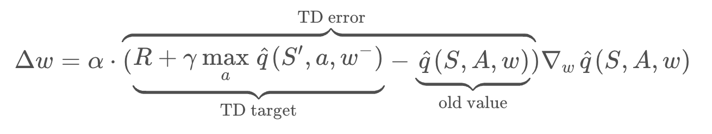

# Problem 1 (Banana Collector) Report

## Content

In this report you will find the following sections:

* Introduction
* Algorithm
* Model architecture
* Training procedure
* Agent performance

## Introduction

This report explains the implementation and training of a RL based agent that is able to solve the Banana Collector problem (see the README.md file for the problem details).

## Algorithm

In order to solve the problem the RL Agent has been trained with the DQN algorithm using Experience Replay and Fixed Q-Targets techniques.

### DQN Algorithm

The general expression of the DQN algorith is:

Please, read the [research paper](https://storage.googleapis.com/deepmind-media/dqn/DQNNaturePaper.pdf) for the complete details of the algorithm.

It is also important to understand the two key techniques applied in order to improve the algorithm performance.

#### Experience Replay

When the agent interacts with the environment, the sequence of experience tuples can be highly correlated. The naive Q-learning algorithm that learns from each of these experience tuples in sequential order runs the risk of getting swayed by the effects of this correlation. By instead keeping track of a replay buffer and using experience replay to sample from the buffer at random, we can prevent action values from oscillating or diverging catastrophically.

The replay buffer contains a collection of experience tuples ({SS}, {AA}, {RR}, {S'S}). The tuples are gradually added to the buffer as we are interacting with the environment.

#### Fixed Q-Targets

In Q-Learning, we update a guess with a guess, and this can potentially lead to harmful correlations. To avoid this, we can update the parameters ww in the network \hat{q} to better approximate the action value corresponding to state SS and action AA with the following update rule:

where w^-w^− are the weights of a separate target network that are not changed during the learning step, and (SS, AA, RR, S'S) is an experience tuple.
